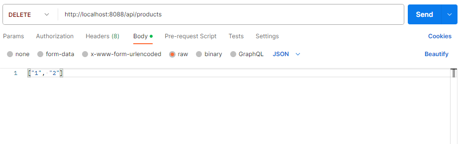

# Simple RestApi Landingpage for Business with Spring Boot
Build a Spring Boot. You’ll know:
- Way to use Spring Data JPA to interact with MySQL Database
- CRUD products
- CRUD order

## Configure Spring Datasource, JPA
Open `src/main/resources/application.properties`
-For MySQL
server.port = 8088

spring.datasource.url = jdbc:mysql://localhost:3306/business
spring.datasource.username = root
spring.datasource.password = 12345678

spring.jpa.hibernate.ddl-auto = none
#spring.jpa.hibernate.ddl-auto = create-drop

spring.jpa.properties.hibernate.dialect = org.hibernate.dialect.MySQL5Dialect


## CRUD products
You could use postman.

- Post product:
`http://localhost:8088/api/products`
```
{
    "name": "product update",
    "shortDescription": "short description update",
    "content": "content update",
    "thumbnail": "thumbnail update",
    "price": 2000000
}
```
or use form for post product: `http://localhost:8088/api/products/upload`


- Put product:
`http://localhost:8088/api/products/{id}`
```
{
    "name": "product update",
    "shortDescription": "short description update",
    "content": "content update",
    "thumbnail": "thumbnail update",
    "price": 2000000
}
```


- Delete product:
`http://localhost:8088/api/products/{id}` 
or `http://localhost:8088/api/products` :



## CRUD order
- Post order on `http://localhost:8088/order-detail`
```
{
    "order": 
    {
        "customerName": "tuấn",
        "customerPhone": "0987654321",
        "customerAddress": "thái bình",
        "content": "chuyển hàng cho mình sớm1.2 21/9/2023"
    },
    "products": 
    [
        {
            "product": 
            {
                "id": 3
            },
            "quantity": 1
        },
        {
            "product": 
            {
                "id": 4
            },
            "quantity": 5
        }
    ]
}
```

